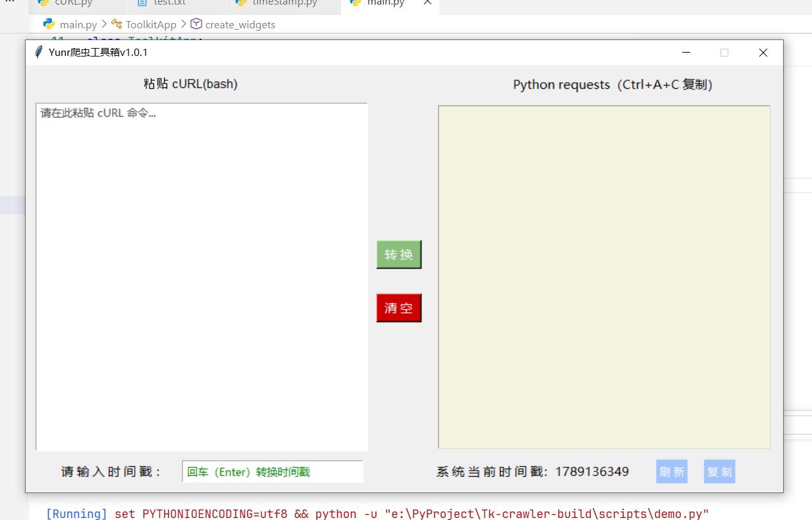
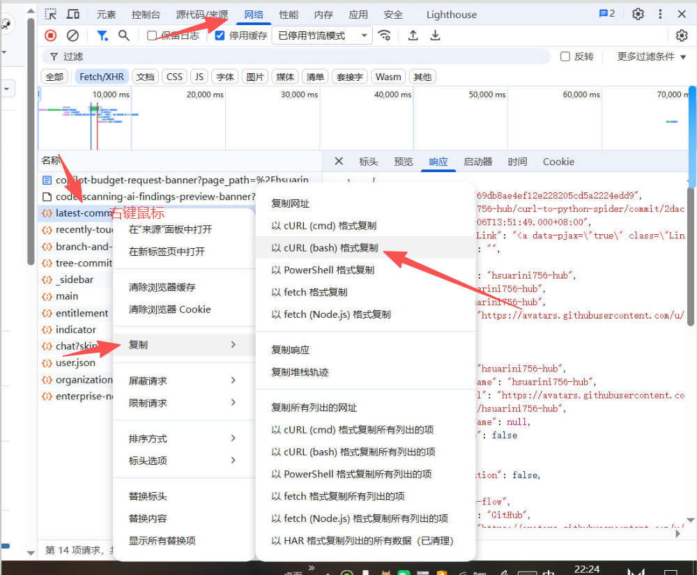

## ✨脚本简单介绍

​		🚀使用的是Python解释器自带的`tkinter`库，有着无需pip下载和轻便的好处。选择原因是因为就开发一个小脚本就直接使用tkinter开发，主要用于自己直接cURL命令转Python爬虫代码，同时底部还有小功能可以解析时间戳和获取当前系统时间戳。

------

## 📦项目脚本可视化GUI样式

## ✨使用方法（三种）

1. 克隆项目到本地或者下载zip文件到本地解压，通过vscode或者PyCharm等解释器直接运行项目中的`main.py`文件即可。
2. 通过cmd命令调用命令行窗口切换到当前项目目录，输入`python main.py`即可。
3. 通过我发布的exe文件下载好直接点击运行。

#### 📁运行项目后将cURL命令复制在左边文本框中，点击转换即可，然后点击右边文本框 `Ctrl+A+V` 复制转换后的代码即可。
